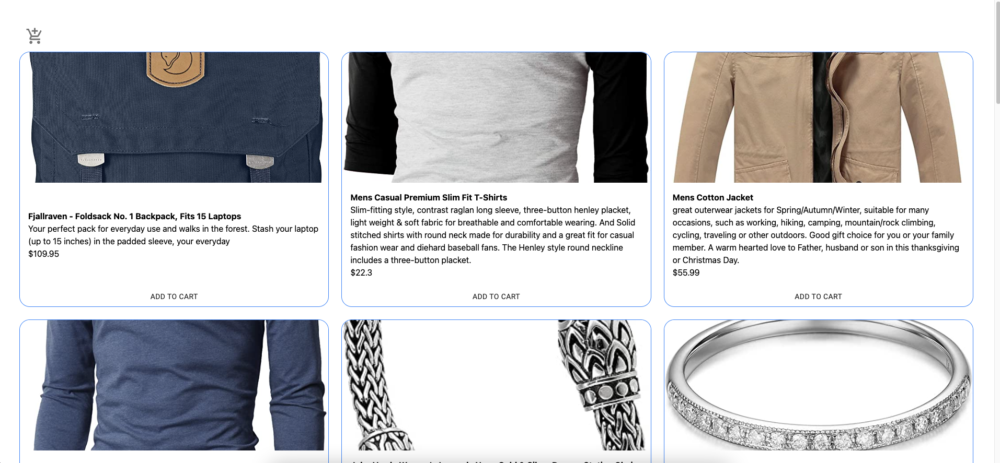
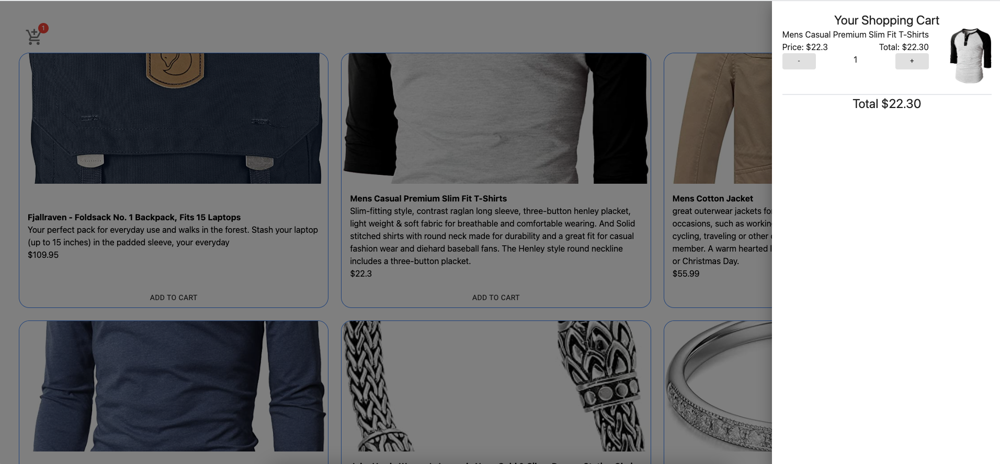

<h1 align="center">
  Typescript Shopping Cart
</h1>

  This is a Shopping Cart built with Typescript & React. The user can add and delete items to the cart and the cart calculates the total price of the items.

  # Main Page
 This is the main page that displays the items. The items are fetched from https://fakestoreapi.com/products

  
  # Empty Cart
 This is the page that displays the cart and if the cart is empty it shows a text that corrects the cart is empty.

  # Items In Cart
 If user clicks add to cart in the main screen the items that selected by the user goes into the cart.

  

